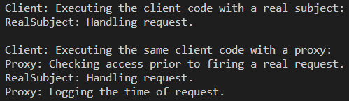

Львівський національний університет природокористування

Факультет механіки, енергетики та інформаційних технологій

Кафедра інформаційних технологій

Звіт з лабораторної роботи №2
на тему: 

# Структурні шаблони. Шаблон замісник (proxy).

Виконав: ст. групи ІТ-22сп Тучапський Д. Ю.
Перевірив: Татомир А. В.

**Мета роботи:** ознайомитися з структурними шаблонами.

## Завдання
1. Ознайомитися з структурними шаблонами.
2. Написати базову програму згідно виданого завдання та проаналізувати її роботу.

## Хід роботи
1. Структурні шаблони відповідають за побудову зручних в підтримці ієрархій класів.  
Замісник — це структурний патерн проектування, що дає змогу підставляти замість реальних об’єктів спеціальні об’єкти-замінники. Ці об’єкти перехоплюють виклики до оригінального об’єкта, дозволяючи зробити щось до чи після передачі виклику оригіналові.  
Приклад з життя. Платіжна картка — це замісник пачки готівки. І чек, і готівка мають спільний інтерфейс — ними обома можна оплачувати товари. Вигода покупця в тому, що не потрібно носити з собою «тонни» готівки. З іншого боку власник магазину не змушений замовляти клопітку інкасацію коштів з магазину, бо вони потрапляють безпосередньо на його банківський рахунок.
2. Написав базову програму згідно виданого завдання.  
[Код програми.](./lab2.py)  

**Висновок:** на даній лабораторній роботі я вивчав структурні шаблони, а саме структурний шаблон замісник(proxy), на прикладі програмного коду показав роботу цього шаблону. В результаті я засвоїв принцип роботи шаблону замісник, програмний код створює об'єкт, замісник спочатку перехоплює цей об'єкт імітуючи надання доступу, потім передає справжній запит, і в кінці імітує журналювання перехоплення і передачі запиту. Я дізнався, що замісник — це структурний патерн проектування, що дає змогу підставляти замість реальних об’єктів спеціальні об’єкти-замінники. Ці об’єкти перехоплюють виклики до оригінального об’єкта, дозволяючи зробити щось до чи після передачі виклику оригіналові.