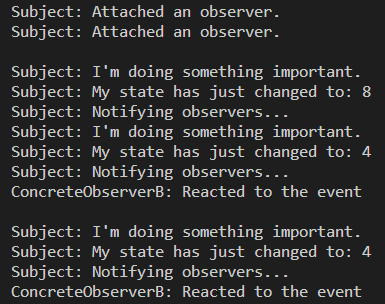

Львівський національний університет природокористування

Факультет механіки, енергетики та інформаційних технологій

Кафедра інформаційних технологій

Звіт з лабораторної роботи №3
на тему: 

# Поведінкові шаблони. Шаблон спостерігач (observer).

Виконав: ст. групи ІТ-22сп Тучапський Д. Ю.
Перевірив: Татомир А. В.

**Мета роботи:** ознайомитися з поведінковими шаблонами.

## Завдання
1. Ознайомитися з поведінковими шаблонами.
2. Написати базову програму згідно виданого завдання та проаналізувати її роботу.

## Хід роботи
1. Спостерігач — це поведінковий патерн проектування, який створює механізм підписки, що дає змогу одним об’єктам стежити й реагувати на події, які відбуваються в інших об’єктах.  
Патерн Спостерігач пропонує зберігати всередині об’єкта видавця список посилань на об’єкти підписників. Причому видавець не повинен вести список підписки самостійно. Він повинен надати методи, за допомогою яких підписники могли б додавати або прибирати себе зі списку. Коли у видавця відбуватиметься важлива подія, він буде проходитися за списком передплатників та сповіщувати їх про подію, викликаючи певний метод об’єктів-передплатників.
2. Написав базову програму згідно виданого завдання.  
[Код програми.](./lab3.py)  

**Висновок:** на даній лабораторній роботі я вивчав поведінкові шаблони, а саме поведінковий шаблон спостерігач, на прикладі програмного коду показав роботу цього шаблону. В результаті я засвоїв принцип роботи шаблону спостерігач, програмний код створює об'єкт, в якому є методи для управління підписниками, клас в якому об'єкт має якись стан, і оповіщає спостерігачів коли стан змінюється, клас спостерігача, об'єкти якого реагують на певні зміни об'єкта до якого вони були приєднані, і два спостерігачі, які реагують на зміни. Я дізнався, що спостерігач — це поведінковий патерн проектування, який створює механізм підписки, що дає змогу одним об’єктам стежити й реагувати на події, які відбуваються в інших об’єктах.